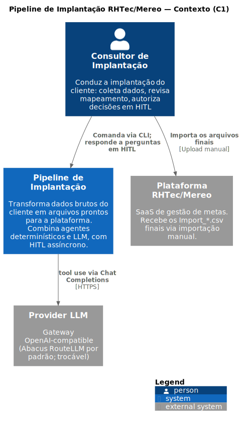
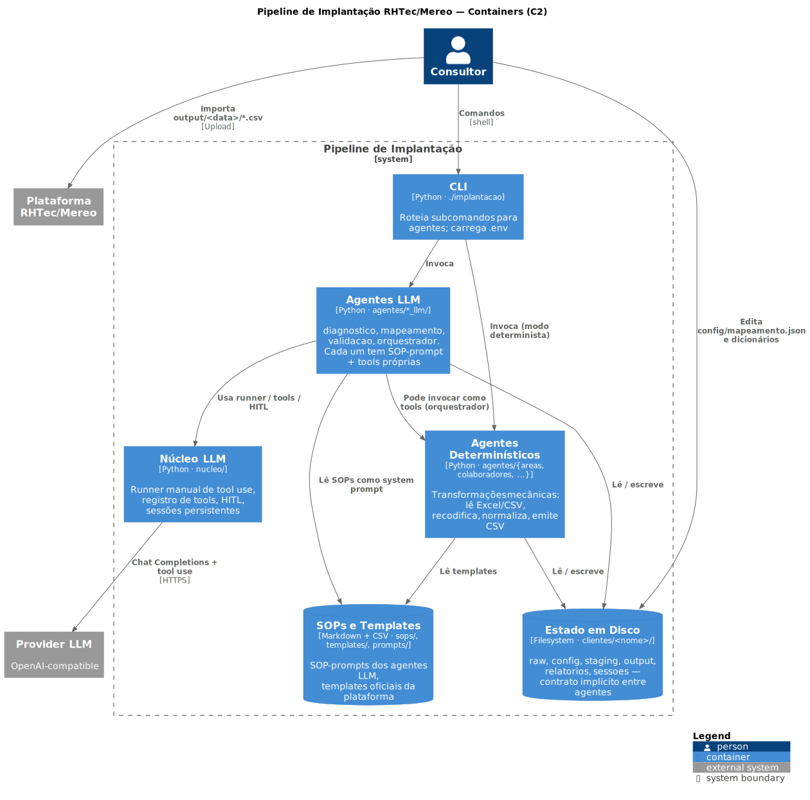
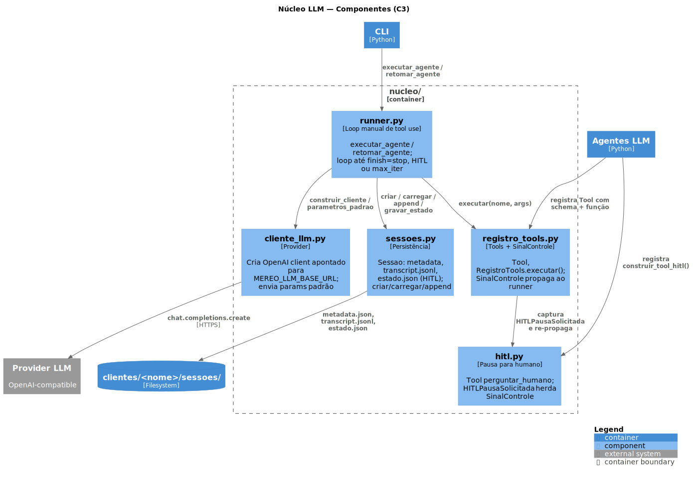
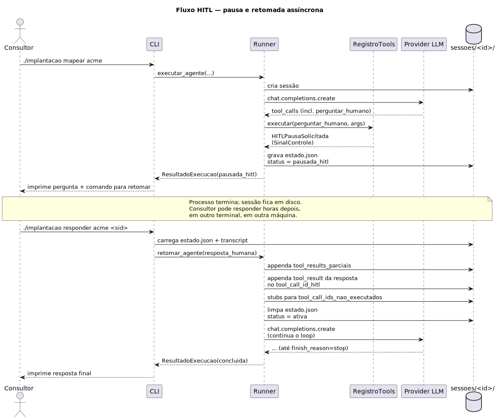

# Arquitetura

Este documento descreve a arquitetura interna do pipeline de implantação RHTec/Mereo: como os agentes se compõem, como o núcleo LLM funciona, como o human-in-the-loop é implementado e como adicionar novos agentes.

> Para o uso operacional do CLI, veja o [`README.md`](README.md). Este documento é para quem precisa entender o código por dentro — manter, depurar ou estender.

---

## Visão geral

O pipeline é organizado em **dois tipos de agente** que cooperam pelo sistema de arquivos. As três visões a seguir seguem o modelo [C4](https://c4model.com/) — do mais externo (contexto) ao mais interno (componente).

> **Diagramas como código:** os fontes PlantUML estão em [`docs/arquitetura/`](docs/arquitetura/). Para regenerar SVG e PNG: `cd docs/arquitetura && make`. Requer Java + PlantUML (veja `docs/arquitetura/Makefile`).

### Nível 1 — Contexto (C4 Context)

Quem usa o sistema, com quais sistemas externos ele fala.



> Fonte: [`docs/arquitetura/01_contexto.puml`](docs/arquitetura/01_contexto.puml)

### Nível 2 — Container (C4 Container)

Os blocos de execução do sistema e como se relacionam. "Container" no jargão C4 é qualquer coisa executável ou de armazenamento — não é Docker.



> Fonte: [`docs/arquitetura/02_container.puml`](docs/arquitetura/02_container.puml)

### Nível 3 — Componente (C4 Component, núcleo LLM)

Zoom no container "Núcleo LLM" — que é o ponto mais denso do código.



> Fonte: [`docs/arquitetura/03_componente_nucleo.puml`](docs/arquitetura/03_componente_nucleo.puml)

- **Agentes determinísticos** fazem as transformações mecânicas: ler Excel/CSV, recodificar valores, normalizar logins, derivar campos. Estão em `agentes/{areas, colaboradores, indicadores, metas, curva_alcance, valores}/`. Cada um expõe uma função `executar(pasta_cliente)` que devolve um dict `{status, dados, erros, avisos}`.
- **Agentes LLM** fazem o que precisa de julgamento: diagnosticar dados desconhecidos, mapear semanticamente origem→destino, validar resultado, orquestrar o pipeline. Estão em `agentes/{diagnostico_llm, mapeamento_llm, validacao_llm, orquestrador_llm}/`. Cada um expõe `construir_registro(pasta, sessao=None)` e `executar(pasta_cliente)`.

A comunicação entre eles é **assíncrona pelo sistema de arquivos** — não há barramento, fila ou banco de dados. A pasta do cliente é o estado.

---

## Estado em disco como contrato

Cada cliente tem uma pasta com a forma:

```
clientes/<nome>/
├── raw/              ← entrada do consultor (read-only após coleta)
├── config/           ← artefatos de planejamento (diagnóstico, mapeamento, dicionários)
├── staging/          ← intermediários por entidade (saída das transformações)
├── output/<data>/    ← arquivos finais para importação
├── relatorios/       ← relatorio_validacao.md, log_pipeline.json
└── sessoes/<id>/     ← histórico de sessões dos agentes LLM
```

Esse layout é **o contrato implícito** entre os agentes:

- O agente de diagnóstico produz `config/diagnostico.json`. O agente de mapeamento depende disso.
- O agente de mapeamento produz `config/mapeamento.json`. As transformações dependem disso, e respeitam a flag `"travado": true` (não regeneram).
- As transformações produzem `staging/NN_entidade/*.csv`. O validador depende disso.
- O validador produz `relatorios/relatorio_validacao.md` e copia para `output/<data>/` quando aprovado.

Como o estado é arquivos, o orquestrador só precisa **inspecionar a pasta** para saber o que falta — é isso que `agentes/orquestrador_llm/agente.py:t_inspecionar()` faz.

---

## Núcleo LLM (`nucleo/`)

O núcleo é minimalista — quatro módulos que o runner combina.

### `cliente_llm.py` — provider

Cliente OpenAI apontado para um gateway compatível. Default: Abacus RouteLLM (`https://routellm.abacus.ai/v1`, modelo `gpt-5`). Configurável via env vars:

| Variável | Função |
|---|---|
| `MEREO_LLM_BASE_URL` | endpoint do provider |
| `MEREO_LLM_API_KEY` | chave do provider |
| `MEREO_LLM_MODEL` | id do modelo |
| `MEREO_MAX_TOKENS` | `max_completion_tokens` por chamada |
| `MEREO_MAX_ITERACOES` | limite de turnos do loop por sessão |

A escolha de OpenAI-compatible (em vez de Anthropic SDK direto) é deliberada — perde-se prompt caching nativo Anthropic e adaptive thinking, mas ganha-se trocar de provider sem mexer em código. Vide `nucleo/cliente_llm.py:1-12`.

### `registro_tools.py` — tools

Estrutura `Tool` (nome, descrição, schema, função, paralela) e `RegistroTools` (dict nome→Tool). O método `executar(nome, entrada)` chama a função e captura erros, **exceto** os que herdam `SinalControle` — esses re-propagam ao runner. Isso é o que permite a tool de HITL pausar a sessão em vez de virar um tool_result de erro:

```python
class SinalControle(Exception):
    """Exceções desta hierarquia NÃO são tratadas como erro de tool: propagam ao runner."""
```

Convenção: qualquer fluxo de controle agente→runner deve herdar `SinalControle`.

### `hitl.py` — pausa para humano

Define `HITLPausaSolicitada(SinalControle)` e a Tool `perguntar_humano`, que simplesmente levanta a exceção. O runner captura, grava o estado, e o CLI mostra a pergunta. Quando o consultor responde, o runner injeta a resposta como `tool_result` da chamada original e continua o loop.

Importante: a pausa é **assíncrona**. Não há thread parada esperando. O processo termina, o estado fica em disco, outra invocação de CLI (`./implantacao responder ...`) reabre a sessão. Isso permite que o consultor responda em outro terminal, em outro horário, em outra máquina.

### `sessoes.py` — persistência

Cada execução de agente LLM cria `clientes/<cliente>/sessoes/<id>/` com:

```
metadata.json    — agente, status, timestamps
prompt.md        — system prompt + tarefa inicial
transcript.jsonl — uma linha por mensagem (formato OpenAI)
estado.json      — só existe quando pausada (info para retomar HITL)
```

A sessão é **stateless quanto a mensagens** — usa append no `.jsonl`. Carregar uma sessão é simplesmente reler o jsonl em ordem.

Agentes específicos podem persistir dados próprios na mesma pasta. O orquestrador, por exemplo, persiste `orquestrador.json` com a lista de etapas determinísticas que executou — sobrevive à pausa/retomada e alimenta o `log_pipeline.json` final.

### `runner.py` — loop manual

Loop manual de tool use com Chat Completions:

```
while iter < max_iter:
    resposta = client.chat.completions.create(...)
    append(resposta.message)

    if finish_reason == "stop":
        return CONCLUIDA
    if finish_reason != "tool_calls":
        return ERRO

    for tool_call in resposta.tool_calls:
        try:
            resultado = registro.executar(tool_call.function.name, args)
            tool_results.append({tool_call_id, content=resultado})
        except HITLPausaSolicitada:
            grava_estado(); return PAUSADA_HITL

    append(tool_results)
```

É manual em vez de SDK porque precisamos de controle fino sobre a pausa por HITL. As funções `executar_agente()` e `retomar_agente()` aceitam uma `Sessao` opcional pré-criada/pré-carregada — útil para agentes que precisam persistir estado próprio referenciando o caminho da sessão (ex: orquestrador).

---

## Anatomia de um agente LLM

Um agente LLM tem três peças:

```
agentes/<nome>_llm/
├── __init__.py
└── agente.py        ← convenção: módulo único, duas funções públicas
```

```
sops/agentes/sop_<nome>.md   ← SOP-prompt (system prompt do agente)
```

A interface pública de qualquer agente é:

```python
def construir_registro(pasta_cliente: str, sessao: Sessao | None = None) -> RegistroTools:
    """Define as tools que o agente pode chamar e retorna o registro."""

def executar(pasta_cliente: str) -> ResultadoExecucao:
    """Roda o agente até concluir ou pausar para HITL."""
```

`construir_registro` é separado de `executar` justamente porque o CLI também precisa dele para retomar uma sessão pausada (`./implantacao responder`) — o registro é reconstruído com o mesmo conjunto de tools antes do `retomar_agente`.

### System prompt = base + SOP

Cada agente compõe seu system prompt assim:

```python
PROMPT_SISTEMA = (
    Path("prompts/sistema/base_agente.md").read_text()
    + "\n\n---\n\n"
    + Path("sops/agentes/sop_<nome>.md").read_text()
)
```

`base_agente.md` é o papel comum (PT-BR, princípios, formato de resposta). `sop_<nome>.md` é o procedimento específico do agente — escrito como instruções operacionais para um humano, e usado como prompt para o LLM. Manter SOPs em arquivos separados permite revisar e versionar a prompt sem mexer em código.

### Tools = ferramentas determinísticas expostas

As tools do agente são funções Python comuns embrulhadas em `Tool(...)`. Convenção do retorno:

```python
{"status": "ok"|"erro", "dados": {...}, "erros": [...], "avisos": [...]}
```

O runner serializa o retorno como JSON antes de enviar ao modelo. Tools "pesadas" (heurísticas determinísticas, leitura de Excel, validação de schema) são tipicamente reutilizadas dos agentes determinísticos via import direto — ex: o agente de mapeamento LLM expõe a heurística sinônimos+similaridade do mapeamento determinístico como uma tool `sugerir_correspondencia`.

### Convenção do retorno final

Quando concluído, o agente devolve um texto em PT-BR seguindo o que a SOP define — geralmente algo como "estado inicial / ações realizadas / estado final / próximo passo sugerido". É isso que o CLI imprime para o consultor.

---

## Fluxo HITL ponta a ponta



> Fonte: [`docs/arquitetura/04_sequencia_hitl.puml`](docs/arquitetura/04_sequencia_hitl.puml)

Em texto, o mesmo fluxo:

```
1. Agente chama tool perguntar_humano(pergunta, contexto, opcoes)
   └► HITLPausaSolicitada é levantada (herda SinalControle)

2. Runner captura no _loop:
   └► grava estado.json com:
        - prompt_sistema
        - tool_call_id_hitl (id da chamada que pausou)
        - tool_results_parciais (resultados das tools que executaram antes da pausa
          no mesmo turno — em paralelo)
        - tool_call_ids_nao_executados (chamadas do mesmo turno que ficaram para trás)
   └► atualiza metadata.status = "pausada_hitl"
   └► retorna ResultadoExecucao(status=pausada_hitl)

3. CLI imprime a pergunta + comando para retomar e termina o processo.

4. Consultor roda ./implantacao responder <cliente> <sessao_id>
   └► CLI lê stdin (Enter duplo encerra), constrói registro, chama retomar_agente

5. retomar_agente:
   └► carrega transcript existente
   └► appenda tool_results_parciais
   └► appenda tool_result com a resposta humana no tool_call_id_hitl
   └► appenda stubs para tool_call_ids_nao_executados (modelo decide se reexecuta)
   └► limpa estado.json
   └► continua o loop
```

O ponto sutil é o passo 5 com `tool_call_ids_nao_executados`: se o modelo emitiu várias tool_calls em paralelo no mesmo turno e uma delas pausou por HITL, o protocolo OpenAI exige que **todas** as chamadas tenham um tool_result correspondente antes da próxima rodada do modelo. Por isso o runner injeta stubs explicando "esta chamada foi pausada antes de executar — reavalie se ainda é necessária", deixando o modelo decidir.

---

## Adicionando um novo agente LLM

Suponha que você queira adicionar um agente `revisor_llm` que revisa o output final. Os passos são:

1. **Criar a SOP-prompt:** `sops/agentes/sop_revisor.md`. Escreva como se fosse um procedimento para um humano novo: papel, princípios, ferramentas disponíveis, critérios de decisão, formato da resposta final.

2. **Criar o módulo do agente:** `agentes/revisor_llm/agente.py`. Estrutura mínima:

   ```python
   from pathlib import Path
   from nucleo.runner import executar_agente
   from nucleo.registro_tools import RegistroTools, Tool
   from nucleo.hitl import construir_tool_hitl

   BASE = Path(__file__).parent.parent.parent
   PROMPT_SISTEMA = (
       (BASE / "prompts/sistema/base_agente.md").read_text(encoding="utf-8")
       + "\n\n---\n\n"
       + (BASE / "sops/agentes/sop_revisor.md").read_text(encoding="utf-8")
   )
   PROMPT_TAREFA = "Revise o output final de <cliente> e produza ..."

   def construir_registro(pasta_cliente: str, sessao=None) -> RegistroTools:
       base = Path(pasta_cliente)
       def t_listar_output() -> dict:
           ...  # implementação
       reg = RegistroTools()
       reg.registrar(Tool(
           nome="listar_output",
           descricao="...",
           input_schema={"type": "object", "properties": {}},
           funcao=t_listar_output,
           paralela=True,
       ))
       reg.registrar(construir_tool_hitl())
       return reg

   def executar(pasta_cliente: str):
       return executar_agente(
           cliente_path=Path(pasta_cliente),
           agente="revisor_llm",
           prompt_sistema=PROMPT_SISTEMA,
           tarefa=PROMPT_TAREFA,
           registro=construir_registro(pasta_cliente),
       )
   ```

3. **Registrar no CLI:** em `cli.py`, adicionar uma linha em `SUBCOMANDOS` (com label `"agente_llm"`) e em `AGENTES_LLM` (mapeando para `agentes.revisor_llm.agente`).

4. **Smoke test:** `./implantacao revisar demo` deve criar uma sessão, listar pelo menos uma tool, e devolver uma resposta final ou pausa por HITL.

Se o agente precisa **persistir estado próprio entre sessões** (como o orquestrador faz com `orquestrador.json`), siga o padrão de `agentes/orquestrador_llm/agente.py`: aceitar `sessao` em `construir_registro`, criar a sessão antes de chamar `executar_agente` e passar a referência adiante.

---

## Decisões arquiteturais relevantes

### Por que dois tipos de agente em vez de tudo LLM?

Transformações são mecânicas: lê Excel, mapeia colunas, normaliza, escreve CSV. Pedir para um LLM fazer isso é caro, lento e introduz risco de erro silencioso (alucinação numa célula). Mantê-las determinísticas dá testabilidade direta (`testes/unitarios/test_agentes.py` cobre as regras críticas) e desempenho.

LLM brilha onde há ambiguidade semântica — "qual aba é colaboradores?", "esse achado bloqueia ou só avisa?", "essa diferença é erro ou variação esperada?". Aí o LLM substitui o consultor lendo o dado pela primeira vez.

### Por que SOPs como prompts em vez de prompts inline?

SOP-prompts ficam em arquivos `.md` separados do código, em PT-BR, escritos como procedimentos para humano. Isso tem três benefícios:

1. **Revisar e iterar é fácil** — não precisa entender Python para ajustar uma instrução do agente.
2. **Diff é legível** — alterações de prompt aparecem como mudanças de texto no git, não como string Python escapada.
3. **Reuso humano** — em alguns casos a mesma SOP pode ser executada por humano (em fallback) ou por LLM, sem reescrever.

### Por que OpenAI-compatible em vez de Anthropic SDK direto?

O usuário tem créditos no Abacus e quer flexibilidade entre providers (RouteLLM, OpenAI direto, Together, Groq, vLLM local). OpenAI-compatible é o denominador comum. Perde-se prompt caching nativo Anthropic e adaptive thinking, mas a API de tool use é genérica o suficiente para todos os providers grandes.

### Por que loop manual em vez do tool runner do SDK?

Para parar de forma controlada quando o agente chama `perguntar_humano` e gravar estado para retomada. SDKs de tool use geralmente assumem execução síncrona até a resposta final — incompatível com HITL assíncrono (sessão pausa, processo termina, retoma horas depois).

### Por que estado em arquivos em vez de banco de dados?

A escala é pequena (dezenas de clientes, não milhões), o estado é predominantemente narrativo (transcripts, JSON), e o consultor precisa **inspecionar e editar** os artefatos manualmente (`mapeamento.json`, dicionários CSV). Banco de dados seria atrito sem benefício.

---

## Estrutura do repositório

```
implantacao/
├── implantacao              ← wrapper shell que chama cli.py com .venv ativo
├── cli.py                   ← roteamento de comandos
├── nucleo/                  ← núcleo LLM (cliente, runner, sessões, tools, hitl)
├── agentes/                 ← agentes determinísticos e LLM
│   ├── areas/, colaboradores/, indicadores/, metas/, curva_alcance/, valores/
│   ├── orquestrador/        ← orquestrador determinístico (modo `transformar`)
│   ├── diagnostico/, mapeamento/, validacao/  ← versões determinísticas
│   ├── exemplo_llm/         ← smoke test da infra
│   ├── diagnostico_llm/, mapeamento_llm/, validacao_llm/, orquestrador_llm/
├── prompts/sistema/
│   └── base_agente.md       ← system prompt comum (papel, princípios, formato)
├── sops/
│   ├── 00_pipeline/         ← SOP de operação via CLI
│   ├── 01_coleta/ ... 05_importacao/  ← SOPs por fase (humanos)
│   └── agentes/             ← SOP-prompts dos agentes LLM
├── templates/               ← templates oficiais da plataforma RHTec/Mereo
├── clientes/
│   ├── _modelo/             ← estrutura copiada por `./implantacao novo`
│   └── <cliente>/           ← uma pasta por cliente
├── testes/unitarios/        ← testes de skills e agentes determinísticos
└── docs/                    ← material histórico do design original
```
